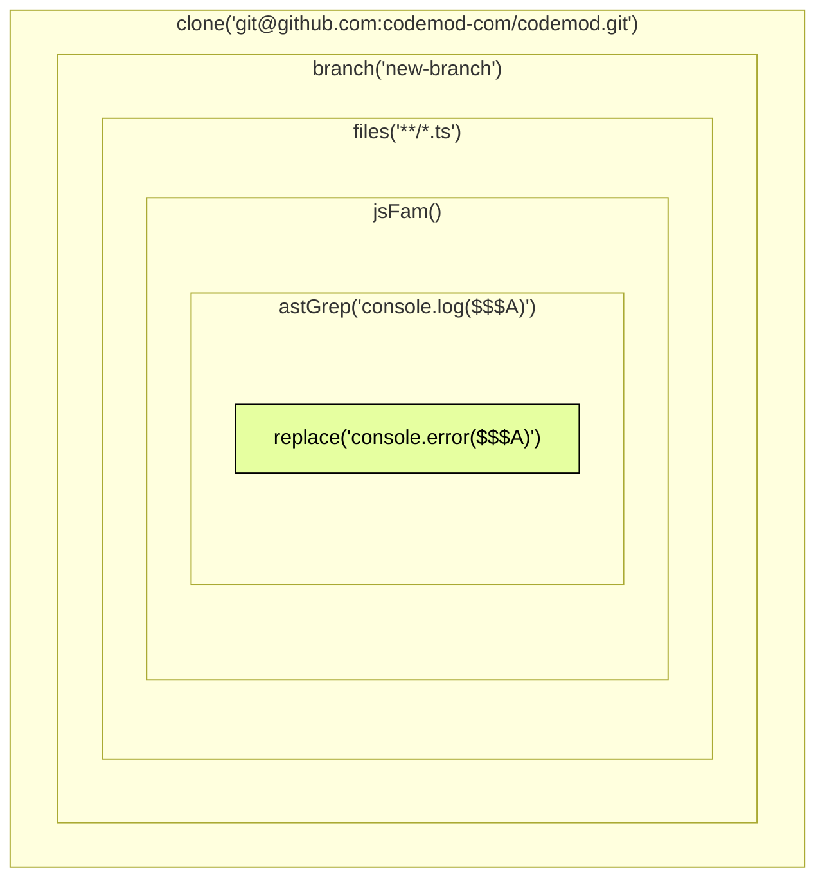
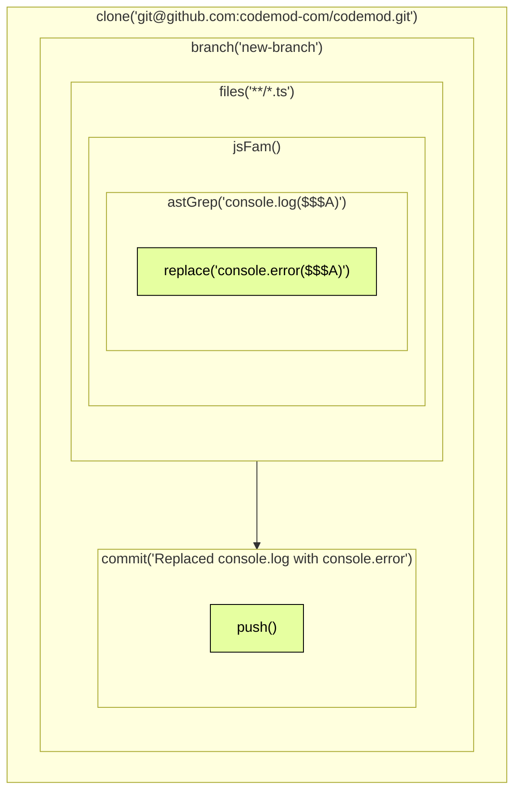

Codemod Workflow Engine is a TypeScript library designed to manage migration tasks at various levels, from code changes to handling repositories and pull requests (PRs). 

Automations built with the Workflow Engine function like any other codemods. Below, you can learn about the core concepts of Workflow Engine. To start building codemods with Workflow Engine, refer to the [API reference](/api-reference).


## Context Propagation

Every migration requires ability to work on different levels simultaneously:

- repository - [clone](/api-reference/git/clone), [branch](/api-reference/git/branch), [commit](/api-reference/git/commit), [push](/api-reference/git/push)
- directories - [iterate](/api-reference/file/dirs), copy, move, remove
- files - [iterate](/api-reference/file/files), copy, move, remove
- code blocks - [iterate](/api-reference/transformation/astgrep), [change](/api-reference/transformation/astgrep/reference#replace-replacement), [remove](/api-reference/transformation/astgrep/reference#replace-replacement)

You need ability to jump between those levels quickly. Child level should be able to access data from parent level. Core principle in workflow engine is passing context. We are using [Asyncronous Context Tracking](https://nodejs.org/api-reference/async_context.html#class-asynclocalstorage) to able to pass context between function calls. When you run a function within context, it will be propagated down to all other function calls. Similar how React context is getting passed down to all the children components.

Context is getting passed inside function's chain calls and also inside callback. Let's look at simple example:

<Tabs>
  <Tab title="Workflow Code">
```tsx
import { git } from '@codemod.com/workflow'

await git
	.clone('git@github.com:codemod-com/codemod.git') // init repository context
	.branch('new-branch') // inside repository context from previous call
    .files('**/*.ts') // find files using glob
	.jsFam() // create js context for every found file inside directory context
	.astGrep('console.log($$$A)') // create context for each found console.log inside file context
	.replace('console.error($$$A)') // replace inside ast-grep context from previous call
```
  </Tab>
  <Tab title="Context Diagram">

  </Tab>
</Tabs>

## Saving and Reusing Context

Function calls with context can be saved and reused:

<Tabs>
  <Tab title="Workflow Code">
```tsx
import { git } from '@codemod.com/workflow'

const repository = await git
	.clone('git@github.com:codemod-com/codemod.git')
	.branch('new-branch');
	
// Do something inside repository
await repository
	.files('**/*.ts')
    .jsFam()
	.astGrep('console.log($$$A)')
	.replace('console.error($$$A)')
	
// Commit changes
await repository
	.commit('Replaced console.log with console.error')
	.push()
```
  </Tab>
  <Tab title="Context Diagram">

  </Tab>
</Tabs>

## Callback Context Retrieval

Another option to retrieve parent context is inside callback function:

```tsx
import { git } from '@codemod.com/workflow'

await git
	.clone('git@github.com:codemod-com/codemod.git')
	.branch('new-branch', async ({ files, commit }) => {
		// callback will automatically get repository context
		console.log(getRepositoryContext());
		// { repository: "git@github.com:codemod-com/codemod.git", branch: "new-branch" }
		await files('**/*.ts')
      .jsFam()
			.astGrep('console.log($$$A)')
			.replace('console.error($$$A)')
			
		await commit('Replaced console.log with console.error')
			.push()
	});
```

## Plugin Creation

Thanks to callback context retrieval, plugins can be created as functions:

```tsx
import * as fs from 'node:fs/promises'
import { files } from '@codemod.com/workflow'

await files()
  .jsFam(async () => {
    // here we have file context
    const imports = await getImports() // which is passed to getImports function
  })

async function getImports() {
  // file context is here from parent call
  // and it is passed down to astGrep function
	const imports = await astGrep('import { $$$NAMEDIMPORTS } from "$SOURCE"')
		.map(({ getMatch, getMultipleMatches }) => ({
			namedImports: getMultipleMatches('NAMEDIMPORTS'),
			source: getMatch('SOURCE'),
		}));
}
```

## Remote Execution

Passing context and ability to retrieve it will open for us more interesting possibilities. **We can wrap every function with higher order function and make child call in different process or even different server.**

```tsx
import { contexts, remoteExecution, git } from '@codemod.com/workflow'

async function wrapper(fn: (...args: any[]) => any) {
	return function(...args: any[]) {
		const snapshot = contexts.getSnapshot(); // get all the contexts for current function call
		return await remoteExecution(fn, args, snapshot);
	}
}

// whenever we will be calling this
// 2 process will be instatiated and callback will be called separately for both
// since wrapper has access to parent contexts
await git.clone([
	'git@github.com:codemod-com/codemod.git',
	'git@github.com:codemod-com/another-repo.git',
], wrapper(async () => {
	// some logic here
}));
```

## Chain Calls

Another interesting feature is **ability to retrieve some data from chain calls and use it later**. For example we can retrieve all usages of `console.log` in our codebase:

```tsx
import { files, contexts } from '@codemod.com/workflow'

const usages = await files()
  .jsFam()
	.astGrep('console.log($$$A)')
	.map(() => {
		const { file } = contexts.getFileContext()
		const { node } = contexts.getAstGrepContext()
		const range = node.range()
		return {
			file,
			line: range.start.line,
			columng: range.start.column,
		}
	})
console.log(usages)
```

There are a lot of scenarios that require such logic during code refactoring.

Most of the functions will have 2 arguments:

1. actual function parameters
2. callback that will have context inside (optional)

## Promises vs Futures

In JavaScript every promise you instantiate is getting called immediately. For example

```tsx
const functionThatReturnsPromise = () => new Promise((resolve) => {
	console.log('started promise execution')
	resolve()
})

const promise = functionThatReturnsPromise()
// "started promise execution" will be printed to stdout
```

In workflow engine we are using lazy promises aka futures, which are getting executed when `await` operator is used.

```tsx
// see https://github.com/sindresorhus/p-lazy
const functionThatReturnsPromise = () => new PLazy((resolve) => {
	console.log('started promise execution')
	resolve()
})

const promise = functionThatReturnsPromise()
// nothing is printed
await promise
// "started promise execution" will be printed to stdout
```

That is important because it will allow us **save context and postpone execution to the future.**

```tsx
import { git } from '@codemod.com/workflow'

const repo1Packages = git.clone('repo1').dirs('packages/*')
const repo2Packages = git.clone('repo2').dirs('packages/*')
const repo3Packages = git.clone('repo3').dirs('packages/*')

const targetRepo = git.clone('target-repo')
// at this point no tasks would be executed

// now we are cloning all the repositories and moving directories
await targetRepo
	.dirs('packages')
	.moveFrom(repo1Packages, repo2Packages, repo3Packages)
```

That should help you **better structure code and parallelize tasks.** It is recommended to use `await` whenever you need execute tasks, otherwise just save links to task execution flow and use it later: `const repo1Packages = git.clone('repo1').dirs('packages/*')` is definition of flow, not actual execution.

## Types and chain calls

Every function is typed and has jsdoc description.

Every function will return lazy promise object with helpers. Once you `await` lazy promise - it will also return helpers. Return is typed and you will get helpers that are currently available.

```tsx
import { git } from '@codemod.com/workflow'

const repoLink = await git.clone('repo')
await repoLink.dirs('packages/*') // get all the packages directories
await repoLink.files().jsFam() // get all the JavaScript files in repository
await repoLink.branch('new-branch')  // create branch
await repoLink.commit('message') // create commit
await repoLink.push() // push
await repoLink.codemod('name') // execute codemod for repository
await repoLink.exec('pnpm', ['install']) // execute command for repository
```

Once you type `repoLink.` - you will get autocomplete in your IDE with list of possible functions.

## Current working directory context

Current working directory is also propagated between function calls. You can call getCwdContext() anytime and get directory. Here is how it works in details:

```tsx
import { contexts, dirs } from '@codemod.com/workflow'

console.log(process.cwd())
// /var/dev
// By default cwd context will equal to a directory where
// workflow is getting executed

// when you will clone repository - temporary directory will be
// created and cwd context will be switched
await git.clone('repo', async () => {
  console.log(contexts.getCwdContext())
  // { cwd: "/var/folders/ck/k3jdjh3140bg7trjh3fdx5_h0000gn/T/cm/repo" }
  
  await dirs('packages/*', async () => {
	  console.log(contexts.getCwdContext())
	  // { cwd: "/var/folders/ck/k3jdjh3140bg7trjh3fdx5_h0000gn/T/cm/repo/packages/lib1" }
	  // { cwd: "/var/folders/ck/k3jdjh3140bg7trjh3fdx5_h0000gn/T/cm/repo/packages/lib2" }
	  // { cwd: "/var/folders/ck/k3jdjh3140bg7trjh3fdx5_h0000gn/T/cm/repo/packages/lib3" }
	  // dirs helper also changes cwd context
  })
});
```

## Getting started

<CardGroup>
	<Card
		title="API reference"
		icon="code"
		href="/api-reference"
	>
		
	</Card>
</CardGroup>
